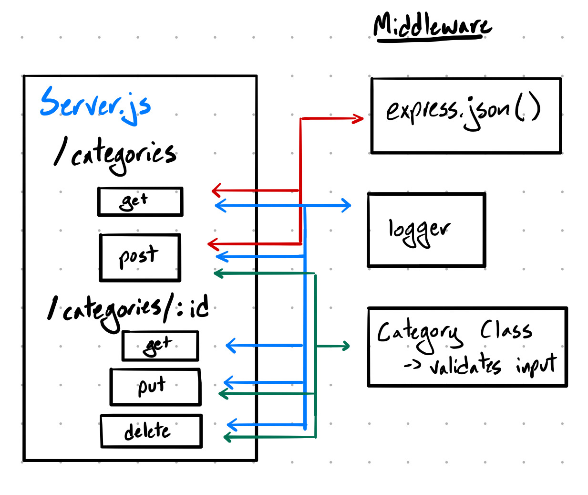

# LAB - 07

## API Server

### Author: Jesse Van Volkinburg and Jagdeep Singh

### Links and Resources
* [submission PR](https://github.com/401-advanced-javascript-jv/07-api-server/pull/3)
* [travis](https://www.travis-ci.com/401-advanced-javascript-jv/07-api-server)

### Setup
#### `.env` requirements
* `PORT` - Port Number

#### Running the app
* `nodemon`
* Endpoint: `/api/v1/categories/`
  * GET - Returns a JSON object with a list of categories
  * POST - Adds a new category to the database and returns a JSON object with the new entry's details.
* Endpoint: `/api/v1/categories/:id`
  * GET - Returns a JSON object with a specific category's details.
  * PUT - Updates the category specified by `:id` and returns a JSON object with the updated details.
  * DELETE - Removes the category specified by `:id`
  
#### Tests
* `npm test`

#### UML

